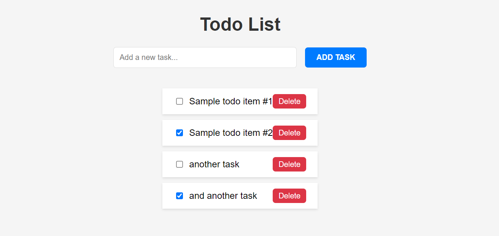

# Todo List Application on GKE

This project demonstrates deploying a simple, basic Todo List application using Python, Flask, and MySQL on Google Kubernetes Engine (GKE). It showcases key cloud computing concepts such as containerization, orchestration, high availability, load balancing, and disaster recovery.



## Project Structure

```graphql
/todo-list-app
│
├── backend
│ ├── app.py                # Flask application
│ ├── requirements.txt      # Python dependencies
│ └── init.sql              # MySQL initialization script
│
├── frontend
│ ├── index.html            # Frontend HTML
│ ├── script.js             # Frontend JavaScript
│ └── style.css             # Frontend CSS
│
├── k8s
│ ├── app-deployment.yaml   # Deployment for Flask app
│ ├── app-service.yaml      # Service for Flask app
│ ├── nginx-deployment.yaml # Deployment for Nginx (optional)
│ ├── nginx-service.yaml    # Service for Nginx (optional)
│ ├── mysql-deployment.yaml # Deployment for MySQL
│ ├── mysql-service.yaml    # Service for MySQL
│ ├── mysql-pv.yaml         # PersistentVolume for MySQL (optional)
│ └── mysql-pvc.yaml        # PersistentVolumeClaim for MySQL (optional)
│
├── Dockerfile              # Dockerfile for Flask app
└── README.md
```

## Prerequisites

- Google Cloud Platform (GCP) account
- Google Cloud SDK installed and configured
- Docker installed for local development and containerization
- kubectl installed for interacting with the Kubernetes cluster

## Setup and Deployment

### Backend Setup


1. Build the Docker image for the Flask application:
   ```bash
   docker build -t gcr.io/YOUR_PROJECT_ID/todo-app:latest .
   ```
2. Push the Docker image to Google Container Registry (GCR):
   ```bash
   docker push gcr.io/YOUR_PROJECT_ID/todo-app:latest
   ```

### Kubernetes Deployment

1. Create the GKE clusters (refer to GCP documentation or setup scripts provided in the k8s directory).
2. Apply the Kubernetes configurations:
   ```bash
   kubectl apply -f k8s/
   ```

## High Availability and Disaster Recovery
- This project includes configurations for a primary and a disaster recovery (DR) site using GKE.
- High availability is achieved through multiple replicas and load balancing.
- For disaster recovery, a secondary GKE cluster can be set up in a different region. Manual or automated failover strategies should be implemented based on the project requirements.

